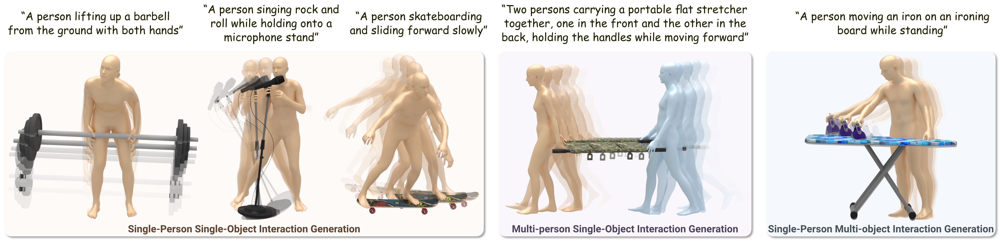

# HOI-PAGE: Zero-Shot Human-Object Interaction Generation with Part Affordance Guidance
By [Lei Li](https://craigleili.github.io/) and [Angela Dai](https://www.3dunderstanding.org/team.html). (ICML 2026)



We present HOI-PAGE, a new approach that prioritizes part-level affordance reasoning to generate high-fidelity 4D human-object interactions (HOIs) from text prompts in a zero-shot fashion. In contrast to prior works that focus on global, whole body-object motion synthesis, our approach explicitly reasons about the underlying fine-grained mechanics of interactions using large language models (LLMs).

We capture this reasoning in a structured part affordance graph (PAG) representation, serving as a high-level interaction scaffolding to guide a three-stage synthesis: first, decomposing input 3D objects into semantic parts; then, generating reference HOI videos from text prompts to extract part-based motion constraints; and finally, optimizing for 4D HOI motion sequences that mimic the reference dynamics while satisfying part-level contact constraints.

Extensive experiments show that our approach is flexible and capable of generating complex multi-object or multi-person interaction sequences, with significantly improved realism and text alignment for zero-shot 4D HOI generation.

## Links

- Paper: https://arxiv.org/pdf/2506.07209
- Video: https://youtu.be/gwXjOffCFyk
- Project page: https://craigleili.github.io/projects/hoipage/

## Citation

```bibtex
@InProceedings{li2026hoipage,
      title     = {{HOI-PAGE}: Zero-Shot Human-Object Interaction Generation with Part Affordance Guidance},
      author    = {Li, Lei and Dai, Angela},
      booktitle = {International Conference on Machine Learning},
      year      = {2026}
}
```

## Install

See [INSTALL.md](INSTALL.md).

## Running

```bash
bash demo.sh
```

## References

1. [GenZI](https://github.com/craigleili/GenZI)
2. [GVHMR](https://github.com/zju3dv/GVHMR)
3. [MoGe](https://github.com/microsoft/MoGe)
4. [nvdiffrec](https://github.com/NVlabs/nvdiffrec)

---

This work is licensed under [Creative Commons Attribution-NonCommercial-ShareAlike 4.0 International](https://creativecommons.org/licenses/by-nc-sa/4.0/).

[](https://creativecommons.org/licenses/by-nc-sa/4.0/)
